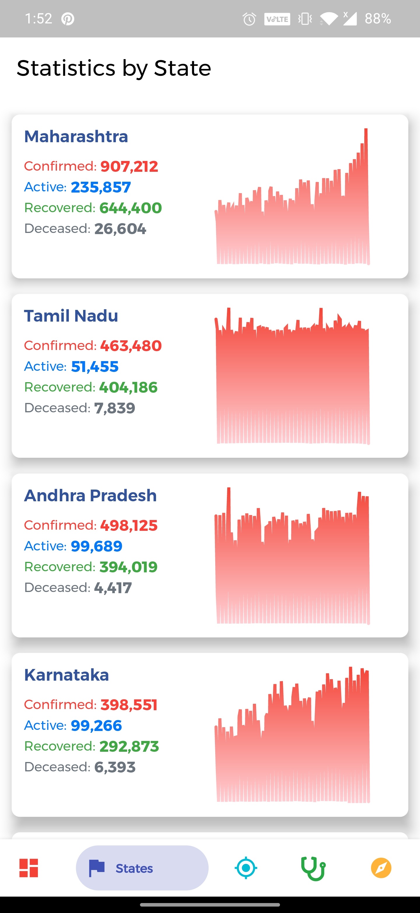

Flutter application to track the number of covid-19 cases in India with a neat clean UI.

# Covid-19 Tracker application:
The idea behind this application is to displays the statistics of Coronavirus COVID-19 in the :india:India and the data are being collected from [https://api.covid19india.org/](https://api.covid19india.org/) and it updates the cases constantly on this app in the India.  

## Samples:
  
   

## Features: 
 - live confirmed, active, recovered and decreased cases
 - cases in Indian States with graphical analysis
 - zone wise districts of india
 - latest health news headlines in India
 - COVID-19 virus facts
 - with self-assessment test you can assess your health
 - cases in Indian districts
 
 
 ## Packages used in Development:
 Flutter Packages | Usage
------------ | -------------
[bloc](https://pub.dev/packages/bloc) | State management
[dio](https://pub.dev/packages/dio) and [http](https://pub.dev/packages/http) | Network Calls
[flutter_sparkline](https://pub.dev/packages/flutter_sparkline) | Charts
[connectivity](https://pub.dev/packages/connectivity) | To check network status
[cached_network_image](https://pub.dev/packages/cached_network_image) | to store images as cache
[url_launcher](https://pub.dev/packages/url_launcher) | To launch links externally
[bottom_navy_bar](https://pub.dev/packages/bottom_navy_bar) | Bottom navigation

Original project cloned from: 
[https://github.com/ankithans/Covid-19-Tracker/](https://github.com/ankithans/Covid-19-Tracker/)  
